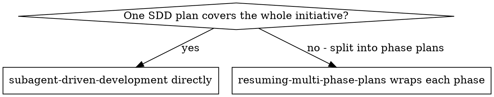

# Resuming Multi-Phase Plans

**Core principle:** an initiative's phase ledgers ARE the resume record. No manifest,
no summary, no reliance on conversation memory — read the ledgers.

**Companion to superpowers:subagent-driven-development**, which executes each phase and
owns the ledger and workspace format this skill reads.

## When to Use



An initiative needs phases when one SDD plan would be too large to review or too long
to execute in one uninterrupted run — the usual signal is a plan whose task count or
scope would otherwise force splitting mid-execution. Phase plans are named
`<initiative-slug>-phase-N-of-M.md` (e.g. `docs/superpowers/plans/billing-phase-2-of-4.md`)
and live alongside single-plan work in the same plans directory.

## Declaring Phases

Nothing beyond the naming convention above and the phase suffix
`subagent-driven-development` writes into each phase's ledger identity line is required:

```
# SDD ledger — plan: <plan file path> (phase N of M: <initiative-slug>)
```

`subagent-driven-development` writes this automatically once you tell it a plan is
phase N of M when dispatching it. There is no separate index file to keep in sync —
the phase ledgers, each written by the phase that owns it, are the single source of
truth. A second, hand-maintained manifest would only give the two a chance to drift.

## The Resume Protocol

Run this at the start of any session that touches a phased initiative — a fresh start,
right after `/clear`, after compaction, or after a crash disrupted an earlier phase.
Trust it over your own recollection or the human partner's summary of "where we left
off"; both fade, the ledgers don't.

1. List every ledger: `.superpowers/sdd/*/progress.md`.
2. Read each identity line. Keep the ones whose phase suffix names this initiative's
   slug; ignore the rest — they belong to unrelated plans, phased or not (the same rule
   `subagent-driven-development` already applies to a mismatched single-plan ledger).
3. Order the kept ledgers by phase N. For each phase, in order, classify it exactly as
   `subagent-driven-development`'s own Setup step classifies a ledger within one plan:
   - **No workspace, or a workspace with no ledger:** phase not started.
   - **Ledger present, last line is a fix round:** phase mid-loop — resume that task's
     fix loop at the next round.
   - **Ledger present, every task has a `complete` line, no `Final review:` line yet:**
     phase's tasks are done but the whole-branch review hasn't run (or hasn't been
     recorded) — resume at Final Review for that phase.
   - **Ledger's last line is `Final review: clean` or `Final review: <K> parked`:**
     phase complete.
4. The first phase that is not complete is where you resume. Everything before it is
   done — do not re-dispatch it, and do not re-verify it beyond `git log` if you want
   reassurance; the commits the ledger names already exist. Everything after it has not
   started.
5. If NO phase's workspace or ledger exists at all, that is ambiguous by itself — it
   matches both "every phase finished and was cleaned up" (the expected end state) and
   "nothing has started yet." Disambiguate with `git log --oneline --grep=<initiative-slug>`
   (ledger completion lines reference commit ranges by hash, but phase-scoped commit
   messages or a merged phase branch are what to look for): commits referencing the
   initiative's phases mean they ran and were cleaned up — resume at whichever phase
   plan has no matching commits yet. No matching commits at all means nothing has
   started — resume at phase 1.

## Clearing Context Between Phases

Once a phase's ledger carries its `Final review: clean`/`<K> parked` line, that line
plus `git log` is everything the next phase needs — nothing forward-relevant is still
living only in this session's conversation. Don't let context accumulate across an
entire multi-phase initiative on the assumption that "it might still be useful":

- Immediately after a phase's final-review line lands in its ledger, clear or compact
  the conversation (or start a new session) before dispatching the next phase.
- Narrate the boundary so your human partner isn't surprised mid-initiative:
  "Phase 2 of 4 complete and ledger durable; clearing context before phase 3."
- After the clear, run the Resume Protocol above rather than assuming you remember
  which phase comes next — the point of clearing is that you don't have to remember.

This is what makes the multi-phase workflow survive compaction, a crashed harness, or a
human closing the terminal between phases: nothing about "where the initiative stands"
depends on this session surviving to the next phase.

## Finish

Once the Resume Protocol's scan finds every phase's ledger ending in a `Final review:`
line, the initiative is complete. Delete every phase's workspace under
`.superpowers/sdd/` for this initiative (`rm -rf` each `<initiative-slug>-phase-*-of-*`
directory) — the git history across all phases is now the record, the same guarantee
`subagent-driven-development` relies on for a single plan. Leave any other initiative's
directories alone.

## Common Rationalizations

| Excuse | Reality |
|--------|---------|
| "I'll just remember which phase we're on" | Conversation memory does not survive compaction or a new session. The ledgers do — read them. |
| "Phase 1's final review was clean, delete its workspace now" | A clean final review is no longer the deletion trigger for a phase. This skill deletes all of them together, once every phase is done. |
| "I'll keep a separate phase-tracking note" | A second record only drifts from the ledgers. The ledgers are the one source of truth — read them fresh every time. |
| "Clearing context feels risky, I might lose track" | The opposite: keeping unbounded context is what makes losing track expensive. The ledgers are what you resume from, not the conversation. |
